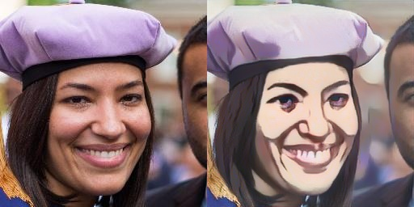

# White-box facial image cartoonizaiton

- Pytorch implementation of a simple facial image cartoonizaiton netowrk
- This work is an improvement based on CVPR2020 White-box cartoonizaiton paper 
- [project page](https://systemerrorwang.github.io/White-box-Cartoonization/) |   [paper](https://github.com/SystemErrorWang/White-box-Cartoonization/blob/master/paper/06791.pdf) |   [twitter](https://twitter.com/IlIIlIIIllIllII/status/1243108510423896065) |   [zhihu](https://zhuanlan.zhihu.com/p/117422157) |   [bilibili](https://www.bilibili.com/video/av56708333)

### Some results

### Installation

- Install pytorch, you don't even need cuda and gpu
- Opencv, numpy and tqdm are needed, I think you already have them

### Inference with Pre-trained Model

- Crop your facial image to 256*256 pixel
- Save them in the 'images' folder
- Run 'inference.py', output will be saved in 'results' folder

### Training code

- Sorry, it's not available now, I am still working on improving this work
- If I am lucky enough, maybe this method will appear in a paper

### License
- Copyright (C) Xinrui Wang All rights reserved. Licensed under the CC BY-NC-SA 4.0 
- license (https://creativecommons.org/licenses/by-nc-sa/4.0/legalcode).
- Commercial application is prohibited, please remain this license if you clone this repo

